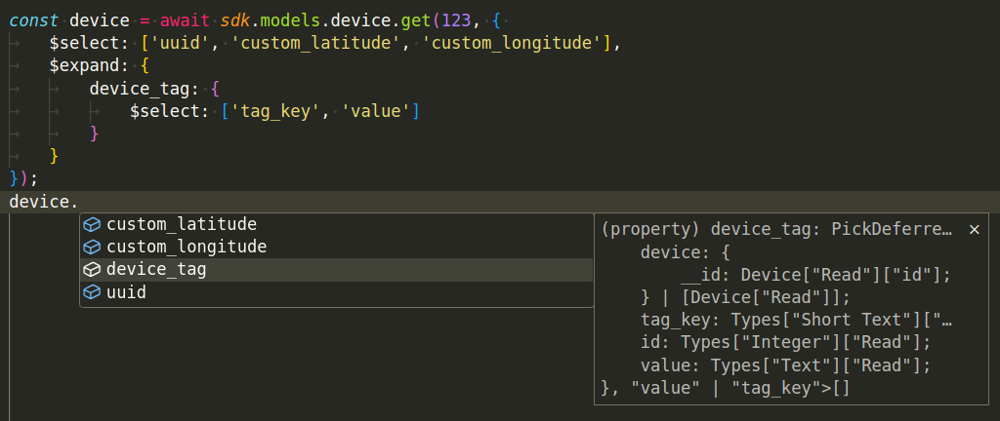

# What's new on balena javascript SDK v22

### Introduction
The [balena JavaScript SDK](https://github.com/balena-io/balena-sdk) is a powerful interface for interacting with balenaCloud.  We're excited to release balena-sdk v22, a significant update focused on enhancing developer experience. The core of this new version is a major improvement in **type inference for API responses**, bringing greater precision and predictability at TypeScript compile-time.

### Breaking Changes
This release includes a few breaking changes that require attention from developers upgrading to balena-sdk v22. While these changes enable significant improvements, it is important to review them to keep compatibility.

- **Signature change for `device.history` methods**:
Previous versions of `device.history.getAllByApplication` and `device.history.getAllByDevice` accepted `fromDate` and `toDate` directly within the options object, which was confusing as these are helper parameters, not Pine options. The signature has been updated to separate these: `(uuidOrId, { fromDate, toDate }, options)`


```js
// before
sdk.models.device.history.getAllByApplication(
    999999, 
    {
        fromDate: new Date('2023-12-25'),
        toDate: new Date('2023-12-27'),
        { $select: ['id', 'os_version'] }
    }
)

// after
sdk.models.device.history.getAllByApplication(
    999999, 
    {
        fromDate: new Date('2023-12-25'),
        toDate: new Date('2023-12-27'),
    },
    { $select: ['id', 'os_version'] }
)
```

- **Deprecation of WebResourceFile helper**: The sdk was previously exporting a helper function to create files for file uploads. This has been removed in favor of standard WebAPI [File API](https://developer.mozilla.org/en-US/docs/Web/API/File). It should be a drop in replacement anywhere using `WebResourceFile` should be replaced with `File`.

Any other changes are mostly connected to the new improved typing system which will be discussed on the following sessions.

### The challenge of dynamic & static typing
balenaCloud offers a very flexible API to fetch data that can be shaped in different ways depending on the (OData) query parameters sent. While incredibly powerful for optimizing data transfer, this dynamic nature presents a significant challenge for static typing in languages like TypeScript. Let's take a look on what that means with some code examples on the current balena-sdk v21:


When we perform a get operation on a device, the returned object initially contains all its properties. However, the balenaCloud API allows us to narrow down to only interesting columns, perform complex filters, and expand on properties. This optimizes data transfers and reduces the number of queries needed to retrieve specific information. Let's suppose we want a script to get only the device `uuid` and its `custom_latitude` and `custom_longitude`.


Now the runtime will only have these three properties. However, the typing system is not aware of this at compile-time, leading us to either write a bunch of manual assertions over the types or write our code with misleading/incomplete types. Both of these solutions are not good, and a better solution would be for **the SDK to be aware, at compile-time, of the correct returned data shape dictated by the query**.

### Introducing the precise type inference in balena-sdk v22

The new sdk version introduces a more complete typing system that can infer the returned typings based on the query on different levels of expressions with `$select`, `$expand` and nested operations. Let's take a look on how this look on code, from the same example above:


The same is valid for more complex and nested queries. Let's take a look on a follow up example with a `$expand` (and expand, will retrieve all associated other resource items to that one via a Foreign Key):



It can now infer that `device_tag` is present, and more over, that `device_tag` will be an `Array` of objects with the properties `tag_key: string` & `tag_value: string`:


This granular control over type inference at compile-time improves the development experience. No longer will you grapple with ambiguous types or resort to manual assertions. These advancements directly translate into tangible benefits for every developer using the balena SDK, such as reduced likelihood of runtime errors coming from mismatched data structures, smarter IDE autocompletion and IntelliSense, minimizing the need for manual type assertions. Ultimately, developers gain increased confidence in their code, ensuring alignment with API responses and fostering more robust and predictable workflows.

### (Advanced) Under the hood: Pine Typings & Advanced Details

balenaCloud API is created with [PineJS](https://github.com/balena-io/pinejs). The new typing system on the SDK uses underneath [PineJS client](https://github.com/balena-io-modules/pinejs-client-js/blob/master/src/index.ts) typing system and query capabilities.

Let's dive deeper into how these typings work, what is exposed via the SDK, and how they can be used in your workflows.

Suppose an application needs to retrieve a list of devices with specific characteristics: online devices in a particular fleet, ordered by their last heartbeat, and only fetching their uuid, device_name, and related device_tags. We also want to ensure that the device_tags are expanded to include their tag_key and tag_value to avoid unnecessary network usage.

Here's how you could achieve this:

```typescript

import { getSdk } from 'balena-sdk';

const sdk = getSdk();
// sdk.auth.login...

async function getDevices(fleetId: number) {
    const devices = await sdk.models.device.getAll({
        $select: ['uuid', 'device_name'],
        $expand: {
            device_tag: {
                $select: ['tag_key', 'tag_value']
            }
        },
        $filter: {
            is_online: true,
            belongs_to__application: fleetId,
        },
        $orderby: {
            last_connectivity_event: 'desc',
        }
    });
}
```

As mentioned before, `devices` will be an array strongly typed to the contents of the `$select` and `$expand` so if we have a follow up function to sync this information to a separate database, something like

```typescript
async function syncTagsToDb(uuid: string, tag: { tag_key: string, tag_value: string }) {
    await db.insertTag(uuid, tag.tag_key, tag.tag_value);
}

function getDevices(fleetId: number) {
    const devices = await sdk.models.device.getAll(...); // from above
    for (const device of devices) {
        for (const device_tag of device.device_tag) {
            await syncTagsToDb(device.uuid, device_tag);
        }
    }
}
```

This call is now fully typed and the types satisfy. One could go even a step further and reuse the `Device['Read']` and `DeviceTag['Read']` types from the SDK to avoid direct string literals, like:

```typescript
import type { Device, DeviceTag } from 'balena-sdk';
async function syncTagsToDb(uuid: Device['Read']['uuid'], tag: Pick<DeviceTag['Read'], 'tag_key' | 'tag_value'>) {
    await db.insertTag(uuid, tag.tag_key, tag.tag_value);
}
```

That would be very similar to the previous function but even better as if for example, one of these properties was nullable, the compiler would have known, and the developer would catch that case before even being able to run this code.

But what if we wanted the function to know about the full return type? We don't want to manually be defining over the full types as above for very long functions that use a complex and nested object. Let's simply say we want the `syncTagsToDb` to receive a single device from the return list, how can I get that typing without manually deduce it? That's what the `Pine.OptionsToResponse` helper is for:

```typescript
import type { Pine, Device, DeviceTag } from 'balena-sdk';

const devicesQuery = {
    $select: ['uuid', 'device_name'],
    $expand: {
        device_tag: {
            $select: ['tag_key', 'tag_value']
        }
    },
    $filter: {
        is_online: true,
        belongs_to__application: fleetId,
    },
    $orderby: {
        last_connectivity_event: 'desc',
    }
} as const; // The as const assertion ensures that the query object's properties are inferred  literal types, which is crucial for OptionsToResponse to work its magic. See: https://stackoverflow.com/a/66993654

// This is a list of devices
type DevicesResponse = Pine.OptionsToResponse<Device['Read'], typeof devicesQuery, undefined>;

async function syncTagsToDb(device: DevicesResponse[number]) {
    for (const tag of device.device_tag) {
        await db.insertTag(device.uuid, tag.tag_key, tag.tag_value);
    }
}


function getDevices(fleetId: number) {
    const devices = await sdk.models.device.getAll(devicesQuery);
    for (const device of devices) {
        await syncTagsToDb(device)
    }
}
```

Taking a look at `OptionsToResponse` definition:
```typescript
OptionsToResponse<
	T extends Resource['Read'],
	U extends ODataOptions<T>,
	ID extends ResourceId<T> | undefined,
>
```
We see that the parameters the generic typing expects are the `Resource['Read']` the options and a final parameter for the `id` on that query (that can be either `undefined` or a real id).

On our case, we are calling `device.getAll` (not `device.get` which expects an id, for example) and thus, the return typing is an `Array` of devices, that's why on the `syncTagsToDb` function we pass `DevicesResponse[number]` that means, any element of the returned `Array<Response>`. 

If we had executed a query with an id, for example, `device.get` the code could have been modified to something like

```typescript
...

const deviceId = 123;
type DevicesResponse = Pine.OptionsToResponse<Device['Read'], typeof devicesQuery, typeof deviceId>;

async function syncTagsToDb(device: DeviceResponse) {
    for (const tag of device.device_tag) {
        await db.insertTag(device.uuid, tag.tag_key, tag.tag_value);
    }
}

function getDevices(fleetId: number) {
    const devices = await sdk.models.device.get(deviceId, devicesQuery);
    await syncTagsToDb(device)
}
```

### Conclusion
balena-sdk v22 represents a significant leap forward in developer experience and reliability for interacting with balenaCloud. By introducing precise type inference for API responses—driven by the underlying Pine typings—we've empowered developers to write more robust, readable, and error-resistant code.

We encourage all developers to upgrade to balena-sdk v22, explore its new features, and experience firsthand the enhanced type safety and improved development workflow.

Get balena-sdk v22: npm install balena-sdk@latest

Explore the Documentation: https://docs.balena.io/reference/sdk/node-sdk/latest/

Contribute on GitHub: https://github.com/balena-io/balena-sdk/pulls

Join the Conversation: [Link to balena forums/community]
